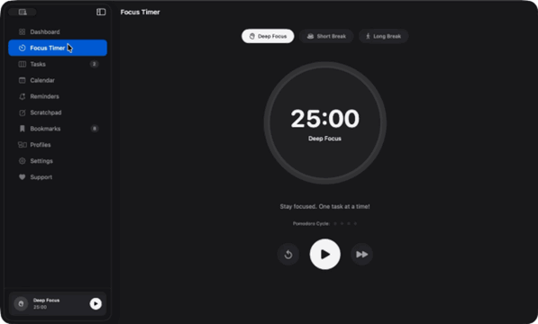
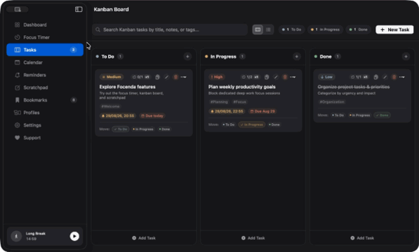
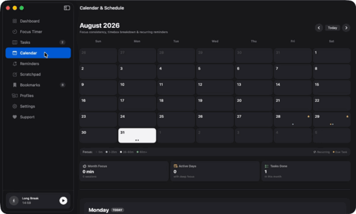
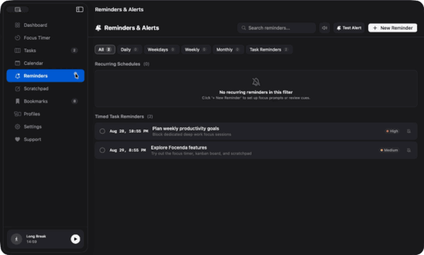
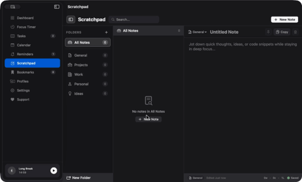
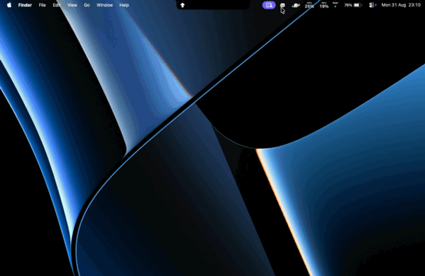
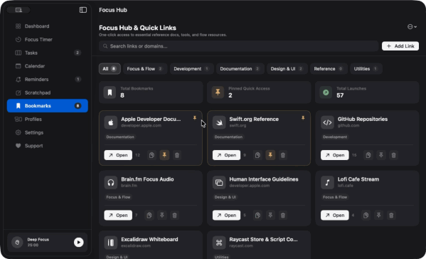

<div align="center">


<br/>

<h1>Focenda</h1>

<hr />

**The native macOS focus, task, and calendar productivity suite.**

*100% Swift | Free & Open Source | Designed for Apple Silicon & Intel macOS*

[](https://github.com/OOMestre/Focenda/actions/workflows/ci.yml)
[](LICENSE)
[](https://apple.com/macos)
[](https://swift.org)
[](https://buymeacoffee.com/omestre)

[Features](#key-features) |
[Quick Start](#quick-start) |
[Installation](#installation) |
[Local Development](#local-development) |
[Contributing](CONTRIBUTING.md) |
[Support](SUPPORT.md) |
[Privacy & Security](docs/PRIVACY.md) |
[Trademarks](TRADEMARKS.md) |
[License](#license)

---

</div>

## Overview

Focenda is a high-performance, distraction-free macOS application engineered to maximize daily focus, calendar timeboxing, and task management.

Combining structured focus cycles (Pomodoro and deep work timers), visual Kanban workflows, notebook scratchpads, quick web resource hubs, and recurring reminders with native macOS system alerts, Focenda delivers a unified, clutter-free productivity system.

<a id="key-features"></a>
## Key Features & Visual Showcase

### Daily Productivity Dashboard
Central command hub featuring dynamic time-of-day greetings, daily focus goal progress rings, real-time productivity statistics (today focus time, completed cycles, pending and high-priority tasks), an active focus session card, and quick-action cards for upcoming due tasks.

---

### Intelligent Focus Timer
Configurable intervals for deep focus, short breaks, and long breaks with smooth circular progress animations, audio chimes, and quick time adjustments (+5m / -5m).

<p align="center">
  
</p>

---

### Floating Mini Timer HUD
Draggable, always-on-top picture-in-picture floating timer panel that stays visible across all macOS Spaces and applications. Seamlessly toggle between a compact mini readout and an expanded control center with quick note capture, fast task entry, and bookmark shortcuts.

---

### Unified Tasks & Kanban Board
Interactive 3-column Kanban workflow with drag-and-drop support, direct status progression pills (To Do, In Progress, Done), Pomodoro counters, due dates, and seamless toggling to a linear list view.

<p align="center">
  
</p>

---

### Interactive Calendar & Day Previews
Full monthly calendar grid with daily focus heatmaps, scheduled tasks, due date milestone indicators, and compact hover previews that stay pinned after clicking a date for quick actions.

<p align="center">
  
</p>

---

### Recurring Reminders
Dedicated scheduler for daily, weekday, weekly, and monthly recurring tasks with native macOS banner alerts, rich chime notifications, and overdue tracking.

<p align="center">
  
</p>

---

### Multi-Notebook Scratchpad
Master-detail quick notes system organized into custom folders (General, Projects, Work, Personal, Ideas) with folder creation, renaming, deletion, customizable icons, live character/word counters, search, and keystroke persistence.

<p align="center">
  
</p>

---

### Menu Bar Control Center
Floating, top-down animated macOS menu bar utility providing quick timer controls, instant note capture into user folders, rapid task creation, and bookmark access without interrupting your workflow.

<p align="center">
  
</p>

---

### Focus Hub & Bookmarks
Responsive quick-launch directory for essential development references, tools, and documentation with 1-click browser integration.

<p align="center">
  
</p>

---

### Global System Shortcuts
Configurable keyboard hotkeys (such as `⌥ + Space` for instant timer toggle) to manage focus cycles and control centers from anywhere in the system without switching windows.

### Guided First-Launch Onboarding
A complete tour of every workspace section and the menu bar control center, replayable from Settings whenever needed.

### Customizable Visual Themes
Five refined aesthetic themes selectable in Settings (Zen Calm Light, Obsidian Minimal Dark, Warm Sandstone, Nordic Frost, Forest Matcha) without disruptive automatic color shifts.

### Private In-App Updates
The dedicated About area shows the app identity and version, checks GitHub Releases manually or once a day, shows native macOS update notifications, and installs validated Focenda archives locally without sending personal data or app content anywhere.

### About Focenda
The About area keeps Focenda's logo, version, open-source project link, license, privacy details, and update controls together in one easy-to-find place.

### Native Support & Feedback Hub
Dedicated in-app support space with accessible actions for reporting bugs or suggesting improvements. Focenda pre-fills the correct GitHub issue template, label, app version, macOS version, and hardware architecture for review before submission.

### 100% Local, Private & Secure
Tasks, notes, reminders, bookmarks, and preferences stay on device in authenticated encrypted local storage. Zero telemetry, no third-party accounts, and zero cloud tracking.

---

## Quick Start

On the first launch, Focenda opens a guided tour covering the Dashboard, Focus Timer, Tasks, Calendar, Reminders, Scratchpad, Bookmarks, Settings, About, Support and the menu bar control center. You can replay it at any time from Settings → Getting Started.

1. **Start a Focus Session:** Open the Focus Timer and start your target interval with one click or spacebar.
2. **Manage Tasks in Kanban:** Navigate to Tasks & Kanban to organize items across columns, set priority levels (High, Medium, Low), or switch to the linear list view.
3. **Inspect Schedule in Calendar:** Open Calendar and hover over any date to preview scheduled items; click a date to keep the preview open and use its quick actions.
4. **Capture Notes:** Use Scratchpad or the Menu Bar popover to take quick notes into dedicated notebooks.

---

## Installation

### Option 1: Homebrew Cask (Recommended)
Install Focenda via [Homebrew](https://brew.sh):

```bash
# One-line install via Homebrew Cask
brew install --cask oomestre/focenda/focenda
```

Alternatively, tap the repository explicitly:

```bash
brew tap oomestre/focenda
brew install --cask focenda
```

To update or uninstall:

```bash
brew upgrade --cask focenda
brew uninstall --cask focenda
```

### Option 2: Direct DMG Download (GitHub Releases)
1. Download the latest `Focenda-macOS.dmg` from [GitHub Releases](https://github.com/OOMestre/Focenda/releases).
2. Open the disk image and drag `Focenda.app` into `/Applications`.
3. Launch `Focenda` from `/Applications` or Spotlight.

### Option 3: Build from Source
```bash
git clone https://github.com/OOMestre/Focenda.git
cd Focenda
make staging
```

---

## Local Development

### Prerequisites
- macOS 14.0 (Sonoma) or newer
- Xcode 15+ / 16+ or Swift 5.9+ / 6.0+

### Development Commands
```bash
# Run full unit test suite (360 automated tests)
make test

# Build release binary executable
make build

# Build staging application bundle and launch
make staging

# Package staging application into distributable disk image (DMG)
make dmg

# Clean build artifacts and caches
make clean
```

---

## Contributing

Contributions are welcome. Please consult [CONTRIBUTING.md](CONTRIBUTING.md) for code style standards, testing requirements, and submission guidelines.

---

<a id="support-the-project"></a>
## Support the Project

Focenda is 100% free, open-source, and independently developed. If Focenda helps you stay focused and productive, consider supporting its continued development!

<p align="center">
  <a href="https://buymeacoffee.com/omestre" target="_blank">
    
  </a>
</p>

- **[Buy Me a Coffee](https://buymeacoffee.com/omestre)** — Support independent macOS development.
- **Star on GitHub** — Help Focenda reach more people by starring it on [GitHub](https://github.com/OOMestre/Focenda).
- **Get Help & Feature Requests** — Consult [SUPPORT.md](SUPPORT.md) for reporting issues and submitting feature proposals.

---

## Privacy & Security

See the [Focenda Privacy and Security Policy](docs/PRIVACY.md) for local
encryption, hardened-runtime behavior, notification handling, and update-service
details.

---

## License & Trademarks

Distributed under the **GNU General Public License v3.0 (GPL-3.0)**. See [LICENSE](LICENSE) for details.

For trademark, logo, and project branding guidelines, see [TRADEMARKS.md](TRADEMARKS.md).
